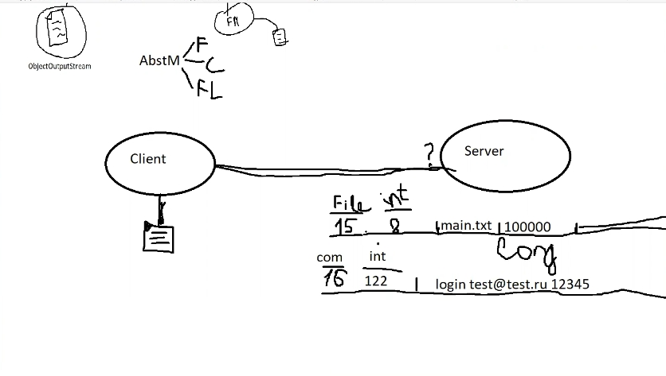

Вопросы:

    1. Как организовать клиент-серверное взаимодействие?
Через сокеты. Сервер открывает сокет, и ждет пока на этот сокет что-то придёт. Когда на сокет приходит информация,
мы делаем проверку, соответствует ли она нашему протоколу. Если нет, то отправляем в ответ ERROR, если да, то обрабатываем 
в соответствии с содержимым.   

    2. Как и в каком виде передавать файлы?
Все объекты будем передавать по протоколу, который напишем сами.
Протокол заключается в следующем:

_Считываем из файла первый бит. В первом бите будет храниться определенное число
Мы создадим map котором будет храниться массив из чисел, каждое из которых что-то означает.
И далее в зависимости от этого будем обрабатывать полученный объект_

    3. Как пересылать большие файлы?
Порциями по частям.

    4. Как пересылать служебные команды?
По протоколу описанному в п.1

    5. Что хранить в базе данных?
В базе данных на сервере (SQLite) будем хранить данные пользователей, логи входов,
логи операций загрузки/скачивания и результаты операций 

    6. Как передавать структуру каталогов/файлов?
Файл или каталог - это один и тот же класс. У каждого из них будет своё поле
`parent`, таким образом получится структура. Для передачи структуры используем Сериализацию.
    
    7. Какую библиотеку использовать для сетевого взаимодействия: java.io, java.nio, Netty?
Ещё не знаю, но походу Netty)) 
